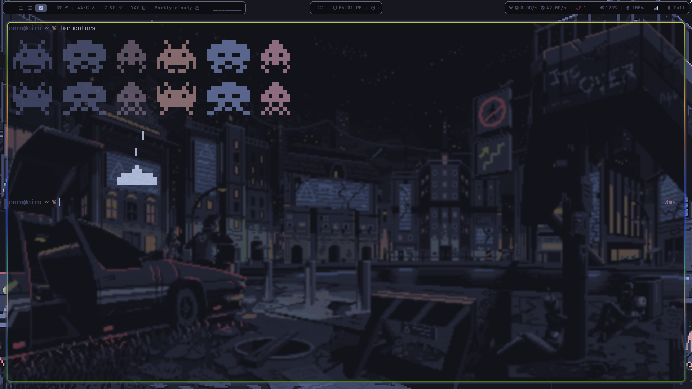
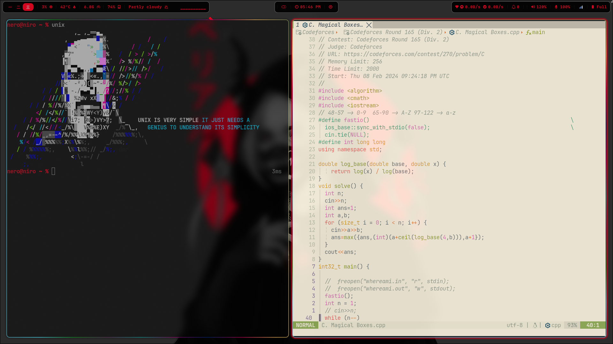

# Dotfiles

Configuration files and scripts I use in my computing.

## Programs used

* Distro - [Gentoo](https://gentoo.org/)
* Shell - zsh 
* Terminal - [Kitty](https://github.com/kovidgoyal/kitty)
* WM - [Hyprland](https://github.com/hyprwm/hyprland).
* Status bar - [waybar](https://github.com/Alexays/Waybar)
* Launcher - [rofi](https://archlinux.org/packages/community/x86_64/rofi/)
* File Manager - [lf](https://github.com/gokcehan/lf)
* Image viewer - [nsxiv](https://wiki.archlinux.org/title/nsxiv) 
* Video player - [mpv](https://wiki.archlinux.org/title/Mpv) 
* Audio player - [mpd](https://wiki.archlinux.org/title/Music_Player_Daemon)+[ncmpcpp](https://wiki.archlinux.org/title/Ncmpcpp)
* Preview images in terminal - [ueberzug](https://archlinux.org/packages/?name=ueberzug)
* RSS reader - [newsboat](https://wiki.archlinux.org/title/Newsboat)
* Various scripts in [~/.local/bin/](.local/bin)

## ScreenShots

## Credits

Certain config files, parts of files and scripts are based on
[voidrice](https://github.com/LukeSmithxyz/voidrice).
[JaKooLit](https://github.com/JaKooLit).
