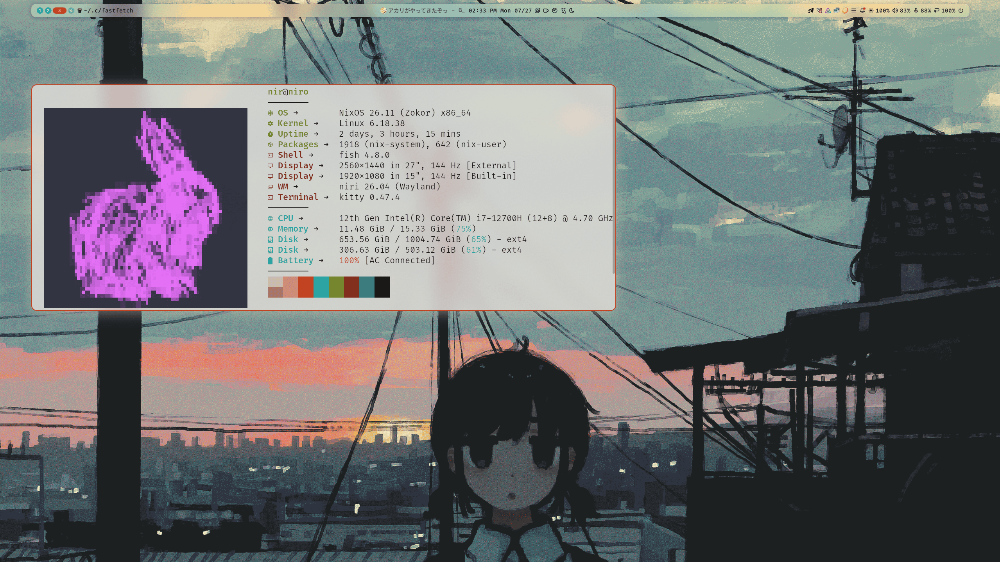

# NixOS Config

NixOS configuration (flake) for two hosts:

- **`niro`** — desktop (x86_64-linux), the control machine.
- **`almiraj`** — netcup ARM VPS (aarch64-linux), public services.

Managed as a `flake-parts` / `flake-file` / `flake-aspects` flake; `flake.nix`
is generated from `nix/flake-file.nix` (do not edit by hand — `nix run .#write-flake`).

## Hosts

| Host    | Platform        | What it runs |
|---------|-----------------|--------------|
| `niro`  | `x86_64-linux`  | Desktop: WM (niri), home-manager, self-hosted LAN services |
| `almiraj` | `aarch64-linux` | VPS: blog, bosla, 3x-ui, frps, gatus, Caddy (public) |

Module layout:
- `modules/base.nix` — global packages + boot (every host)
- `modules/desktop.nix`, `modules/pkgs.nix`, `modules/core.nix` — desktop/niro
- `modules/selfhost/` — niro LAN services (Caddy/FRP/Gatus generators)
- `modules/server/` — VPS services, each gated by `my.server.<x>.enable`
- `modules/backup.nix` — niro pulls VPS backups to `/mnt/media` (systemd timer)

Host enablement is set in `nix/hosts/<host>/default.nix`.

## Programs used (desktop)

- Distro - [NixOS](https://nixos.org/)
- Shell - [Noctalia](https://github.com/noctalia-dev/noctalia-shell)
- Terminal - [Kitty](https://github.com/kovidgoyal/kitty)
- WM - [niri](https://github.com/YaLTeR/niri)
- Launcher - [rofi](https://archlinux.org/packages/community/x86_64/rofi/)
- File Manager - [yazi](https://github.com/sxyazi/yazi)
- Image viewer - [nsxiv](https://wiki.archlinux.org/title/nsxiv)
- Video player - [mpv](https://wiki.archlinux.org/title/Mpv)
- Audio player - [mpd](https://wiki.archlinux.org/title/Music_Player_Daemon)+[ncmpcpp](https://wiki.archlinux.org/title/Ncmpcpp)
- RSS reader - [newsboat](https://wiki.archlinux.org/title/Newsboat)
- Editor - [neovim](https://neovim.io/) (via nvf)

## Deploy a config change to the VPS

1. `rsync -az --delete --exclude .git --exclude result --exclude .direnv /home/nir/nixos-config/ admin@152.53.81.54:/tmp/dotfiles/`
   — `--delete` is required or removed files linger and break the box build.
2. On box: `sudo rsync -a --delete /tmp/dotfiles/ /etc/nixos/ && sudo rm -rf /etc/nixos/.git`
   (flake-eval only reads git-tracked files, so the `.git` must be removed).
3. On box: `sudo nixos-rebuild switch --flake /etc/nixos#almiraj`

On the desktop, `git add` new `.nix` files before `nix eval`/`build` (the flake
eval ignores untracked files). See `../Documents/servernetcup/` for full plans.